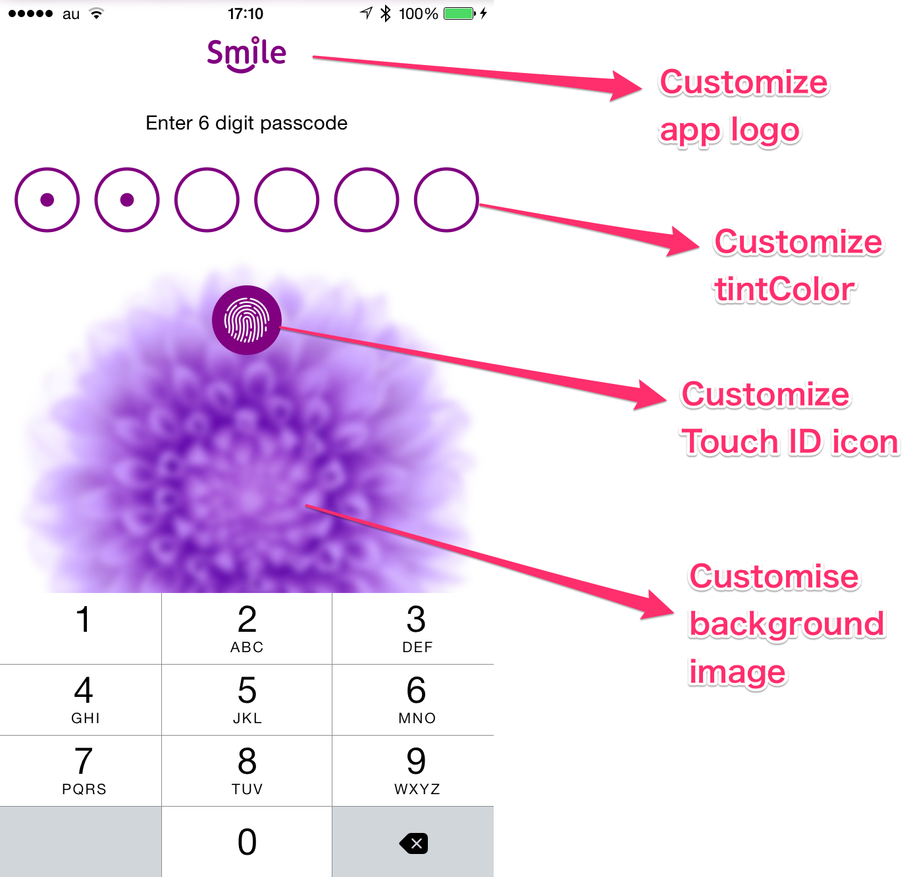
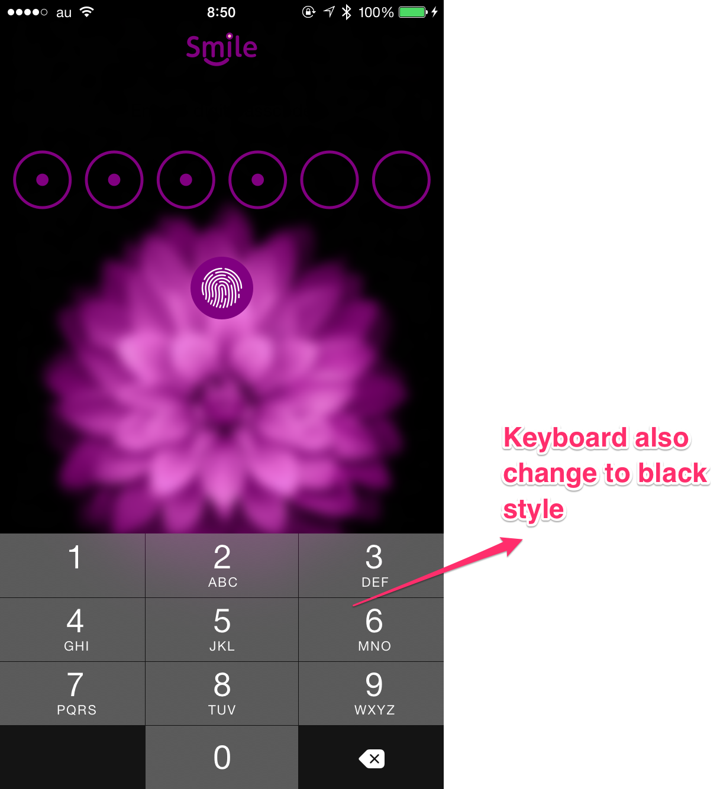
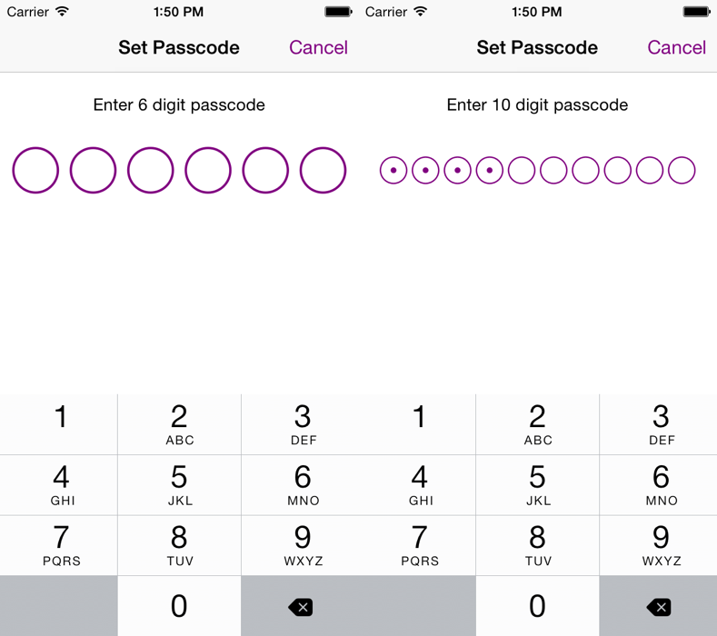
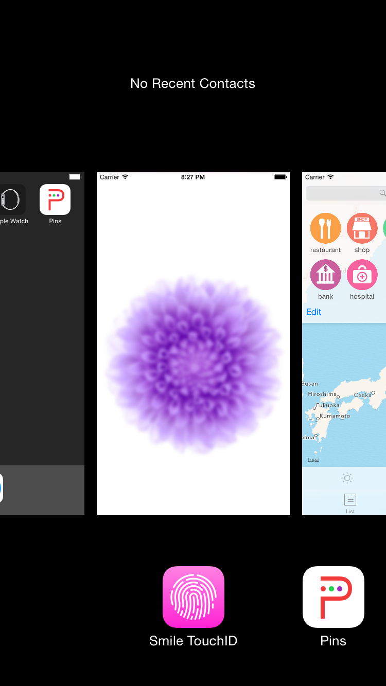

# SmileTouchID

[](https://github.com/liu044100/SmileTouchID/issues)
[](http://cocoadocs.org/docsets/SmileTouchID)
[](http://cocoadocs.org/docsets/SmileTouchID)
[](http://cocoadocs.org/docsets/SmileTouchID)

A library for integrate Touch ID &amp; Passcode to iOS App conveniently.


#What can it do for you?


##### 1. Handle all complicated things about Touch ID & Passcode. You just need to write a few simple code to integrate Touch ID & Passcode to your app.


For example, handle the device that not support Touch ID, instead of Touch ID, use Passcode for authentication.

handle the whole process about securing the app (the user change passcode or turn passcode off),


```Objective-c
if ([SmileAuthenticator hasPassword]) {
        [SmileAuthenticator sharedInstance].securityType = INPUT_TOUCHID;
        [[SmileAuthenticator sharedInstance] presentAuthViewController];
    }
```


##### 2. Get elegant animation and adaptive UI automatically.


##### 3. Can customize the color，Touch ID icon and background image to fit your app style. For example, you can customize like the below image.

```Objective-c
[SmileAuthenticator sharedInstance].tintColor = [UIColor purpleColor];
[SmileAuthenticator sharedInstance].touchIDIconName = @"my_Touch_ID";
[SmileAuthenticator sharedInstance].appLogoName = @"my_Logo";
[SmileAuthenticator sharedInstance].navibarTranslucent = YES;
[SmileAuthenticator sharedInstance].backgroundImage = [UIImage imageNamed:@"backgroundImage"];

```


You can use the property `nightMode` to change all the UI element to black style, like the below image.

```Objective-c
[SmileAuthenticator sharedInstance].nightMode = YES;
[SmileAuthenticator sharedInstance].backgroundImage = [UIImage imageNamed:@"nightMode_BG"];

```


##### 4. Can customize the passcode digit to 6 or 10, or any number, automatically handle other things for you.

```Objective-c
[SmileAuthenticator sharedInstance].passcodeDigit = 6;
```

If you want to try this feature in the demo app, before you try to change `passcodeDigit` to new number, make sure turn off the passcode switch, because the keychain will save your old passcode even you delete the app, so you have to clear the old passcode in keychain, and then change new digit for test.



##### 5. Support iOS7 and later. 

In iOS7, because Apple had not given the TouchID API to developers, only use Passcode for authentication. 


#Theoretical Introduction

The main class is the `SmileAuthenticator`. It has a property `SecurityType` that has four types： `INPUT_ONCE`, `INPUT_TWICE`, `INPUT_THREE`, `INPUT_TOUCHID`. The reason for this name is that show the user input times.


**`INPUT_ONCE`:** For the user turn the passcode switch off, user need input their passcode only one time for turn the password off.


**`INPUT_TWICE`:** For the user turn the password switch on, user need input their password once and re-enter their password one more time for confirm it to match each other.


**`INPUT_THREE`:** For the user change the password, user need input their old passcode one time, then input their new passcode one time and re-enter one time for confirm, a total of three times.


**`INPUT_TOUCHID`:** For the user open the app, user can use touch ID or input passcode to unlock.


Use `[[SmileAuthenticator sharedInstance] presentAuthViewController]` to present view for authentication.


#How to use it for your project?

**Step 1.** SmileTouchID is available through use [CocoaPods](http://cocoapods.org). To install
it, simply add the following line to your Podfile:

```Ruby
pod 'SmileTouchID'

```
Or you can drag the `SmileAuth` folder to your project.

**Step 2.** Import `SmileAuthenticator.h` to your `AppDelegate.m`, and add below line to `didFinishLaunchingWithOptions`.

```Objective-c
[SmileAuthenticator sharedInstance].rootVC = self.window.rootViewController;
```


**Step 3.** In your project root view controller,  add below line to `viewDidAppear:`.

```Objective-c
if ([SmileAuthenticator hasPassword]) {
        [SmileAuthenticator sharedInstance].securityType = INPUT_TOUCHID;
        [[SmileAuthenticator sharedInstance] presentAuthViewController];
    }
```


**Step 4.** Configure with your interactive UI parts,  set appropriate `securityType`, then call `presentAuthViewController`. 

For example below image show a switch to turn the passcode on/off, when the switch turn on, the `securityType` is `INPUT_TWICE`, when turn off, the `securityType` is `INPUT_ONCE`. A button for change passcode, the `securityType` is `INPUT_THREE`.

```Objective-c
- (IBAction)changePassword:(id)sender {
    [SmileAuthenticator sharedInstance].securityType = INPUT_THREE;
    [[SmileAuthenticator sharedInstance] presentAuthViewController];
}

- (IBAction)passwordSwitch:(UISwitch*)passwordSwitch {
    if (passwordSwitch.on) {
        [SmileAuthenticator sharedInstance].securityType = INPUT_TWICE;
    } else {
        [SmileAuthenticator sharedInstance].securityType = INPUT_ONCE;
    }
    
    [[SmileAuthenticator sharedInstance] presentAuthViewController];
}

```


Update your interactive UI parts in `viewWillAppear`.

For example, below code show update the switch and button based on `[SmileAuthenticator hasPassword]`.

```Objective-c
-(void)viewWillAppear:(BOOL)animated{
    [super viewWillAppear:animated];
    
    if ([SmileAuthenticator hasPassword]) {
        self.mySwitch.on = YES;
        self.changePasswordButton.hidden = NO;
    } else {
        self.mySwitch.on = NO;
        self.changePasswordButton.hidden = YES;
    }
}
```


**Step 5.** Build your project, very simple :)

#About Delegate callback

`SmileAuthenticator` has a delegate that can get more information about the process of authentication.

The delegate name is `SmileAuthenticatorDelegate`. It has four optional method.

```Objective-c
@protocol SmileAuthenticatorDelegate <NSObject>
@optional
/*!The method is called when AuthViewController be presented*/
-(void)AuthViewControllerPresented;
@optional
/*!The method is called when AuthViewController be dismissed*/
-(void)AuthViewControllerDismssed;
@optional
/*!The method is called when user success authentication by using Touch ID & Passcode*/
-(void)userSuccessAuthentication;
@optional
/*!The method is called when authentication failed*/
-(void)userFailAuthenticationWithCount:(NSInteger)failCount;
@optional
/*!The method is called when user turn password on.*/
-(void)userTurnPasswordOn;
@optional
/*!The method is called when user turn password off.*/
-(void)userTurnPasswordOff;
@optional
/*!The method is called when user change password.*/
-(void)userChangePassword;
```
# Localization
Sorry about it, but you have to do it yourself. Add below line to your `Localizable.strings`. For detail please see the example demo app.

```Objective-c
/*
 UNIVERSAL PARTS
 */
"SMILE_REASON" = "Are you device owner?";
"SMILE_INPUT_FAILED" = "%ld Failed Passcode Attempt. Try again.";
"SMILE_INPUT_DESCRIPTION" = "Enter %ld digit passcode";
"SMILE_INPUT_NOT_MATCH" = "Passcode not match. Try again.";
"SMILE_INPUT_RE-ENTER" = "Re-enter your %ld digit Passcode";

/*
 INPUT_TOUCHID
 */
"SMILE_INPUT_TOUCHID_TITLE" = "Enter Passcode";


/*
 INPUT_ONCE
 */
"SMILE_INPUT_ONCE_TITLE" = "Turn off Passcode";


/*
 INPUT_TWICE
 */
"SMILE_INPUT_TWICE_TITLE" = "Set Passcode";


/*
 INPUT_THREE
 */
"SMILE_INPUT_THREE_TITLE" = "Change Passcode";
"SMILE_INPUT_THREE_STEP_1_DESCRIPTION" = "Enter your old %ld digit Passcode";
"SMILE_INPUT_THREE_STEP_2_DESCRIPTION" = "Enter your new %ld digit Passcode";

```
# Tips For Security

Because iOS automatically snapshot screen, so when the app resign the active & the user have turned the passcode on, You can use a cover image to cover the UI for protecting user data when the user double tap home button, or the app enter the background.

For more detail, please check the [example project](https://github.com/liu044100/SmileTouchID/tree/master/Example).

```Objective-c
- (void)applicationWillResignActive:(UIApplication *)application {
    if ([SmileAuthenticator hasPassword] && [SmileAuthenticator sharedInstance].isShowingAuthVC == NO) {
        [self showCoverImageView];
    }
}

- (void)applicationDidBecomeActive:(UIApplication *)application {
    if ([SmileAuthenticator hasPassword]) {
        //if now is authenticated, remove the cover image.
        if([SmileAuthenticator sharedInstance].isAuthenticated){
            [self removeCoverImageView];
        }
    }
}
```



# Contributions

* Warmly welcome to submit a pull request.

# Contact

* If you have some advice or find some issue, please contact me.
* Email [me](liu044100@gmail.com)

# Thanks
Thanks for raywenderlich's tutorial about [securing iOS User Data](http://www.raywenderlich.com/92667/securing-ios-data-keychain-touch-id-1password), I am inspired by this tutorial.

# License

SmileTouchID is available under the MIT license. See the LICENSE file for more info.
